# poster-style-studio · 海报风格工作台

[中文](README.md) | [English](README.en.md)

**给一张喜欢的海报参考图，生成一个真正可编辑、可保存工程、可交给伙伴接力创作的网页工作台。**

这个 Skill 帮助 Agent 分析参考图的视觉语言，和用户确认会影响重建方式的选择，再在用户指定的本地目录生成专属 `index.html`、初始 `.posterproj` 工程、预览和可静态部署的 `site/`。它会先判断用户应以什么单位编辑关键风格要素，再选用普通贴纸、带实例参数的特殊贴纸、带填字槽位的组件或实时可调的生成纹样。不同风格共享同一套编辑底座。

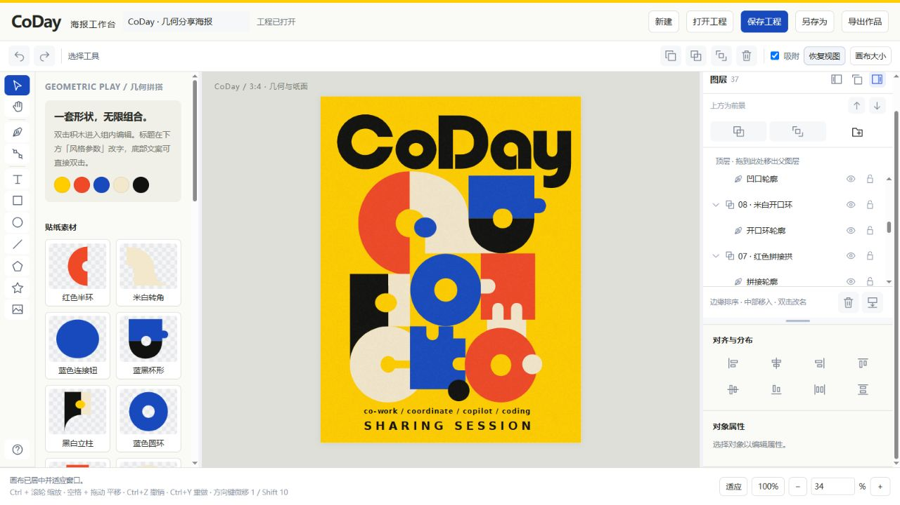

## 三种风格，同一套编辑底座

下图展示此前由本 Skill 构建的工作台界面；它们是视觉方向示例，不代表新版编辑单位设计已回填到这些旧工程。仓库只收录展示截图，不包含这些活动的完整工程与素材。

| CoDay · 几何海报工作台 | Herstory · 网点海报工作台 | 实战分享 · 像素海报工作台 |
| --- | --- | --- |
|  | 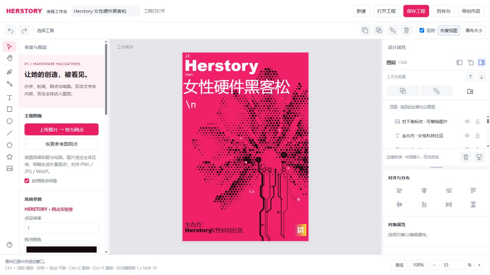 | 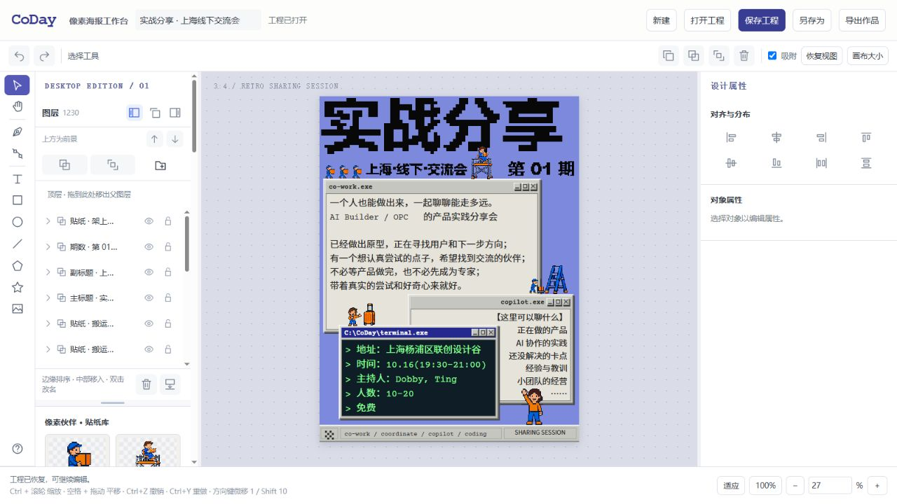 |
| 拼块作为可重复添加的矢量贴纸，颜色与结构可重新组合。 | 点阵与线路图形保留专属参数和图层，支持动效扩展。 | 像素字形、窗口和人物贴纸进入同一工程模型。 |

编辑器仍保留通用的选择、变换、图层、钢笔、文字、填充、描边与效果属性：

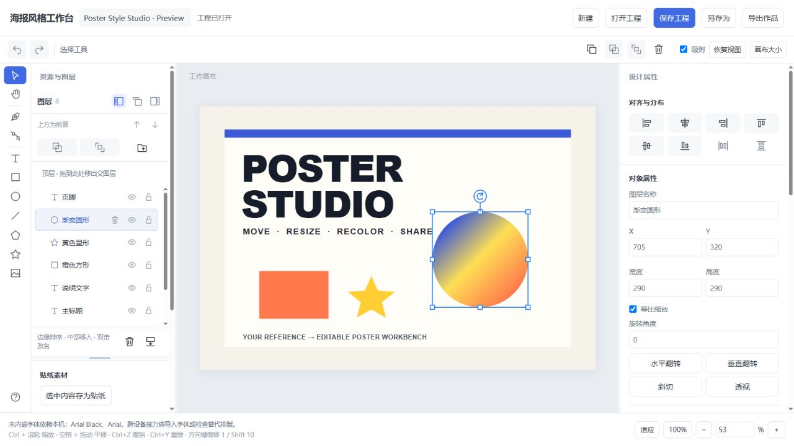

## 从一张参考图，扩展成一套系列物料

工作台的价值不只在于复刻一张海报，而是把配色、字形、纹理、构图关系和专属图形拆成可继续编辑、重新组合的对象。下面是使用对应风格工作台完成的实际衍生案例：内容、人物和画幅都可以变化，但视觉语言仍保持统一。

### CoDay：几何拼块跨画幅重组

| 竖版主视觉 | 16:9 横版衍生 |
| --- | --- |
| 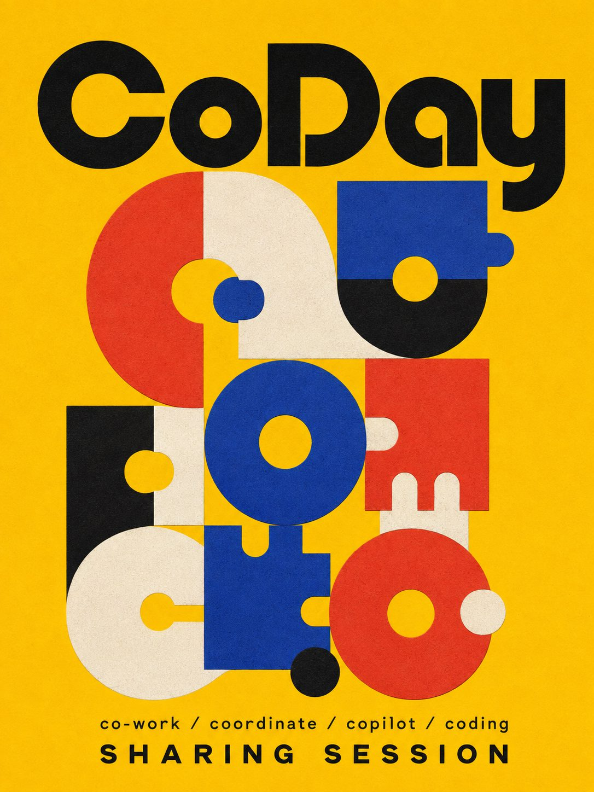 | 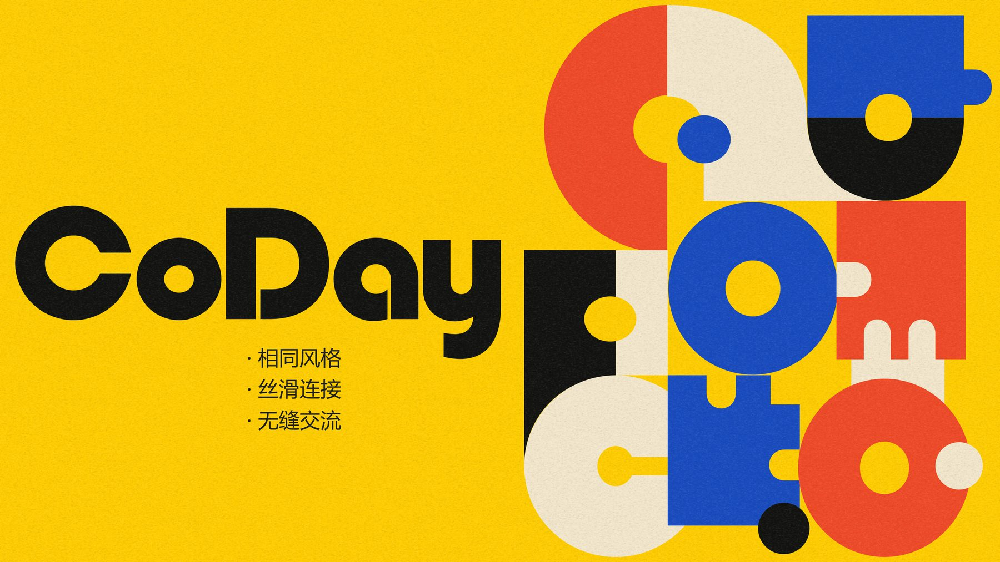 |

圆形、拱形、缺口和拼块被保留为可重组的视觉单元。横版不是把竖版简单裁切，而是重新安排标题与图形重心，同时延续黄、红、蓝、黑的配色和纸张颗粒感。

### Herstory：从活动海报扩展到完整品牌物料

| 风格起点 | 系列活动海报 |
| --- | --- |
| 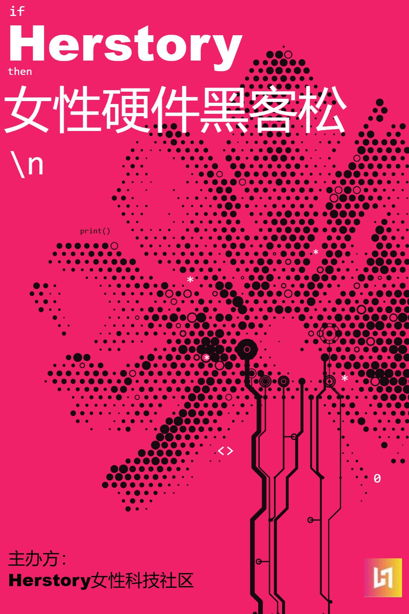 | 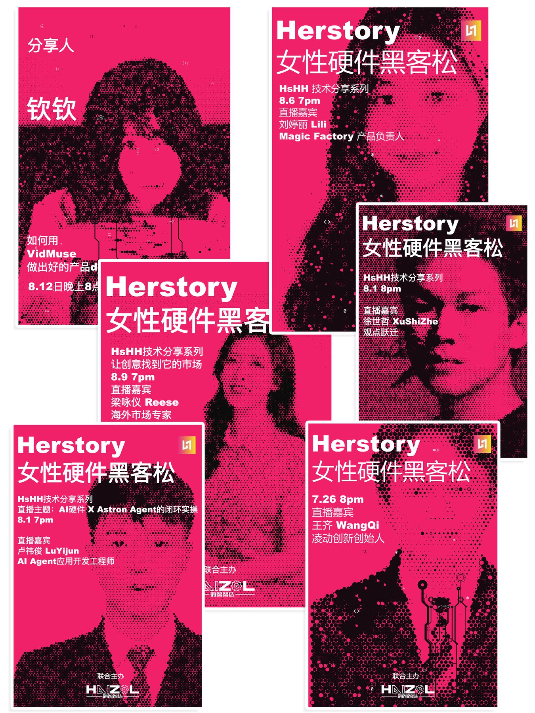 |

| 品牌页面、证书与大型活动物料 | 参会证件正反面与角色变体 |
| --- | --- |
| 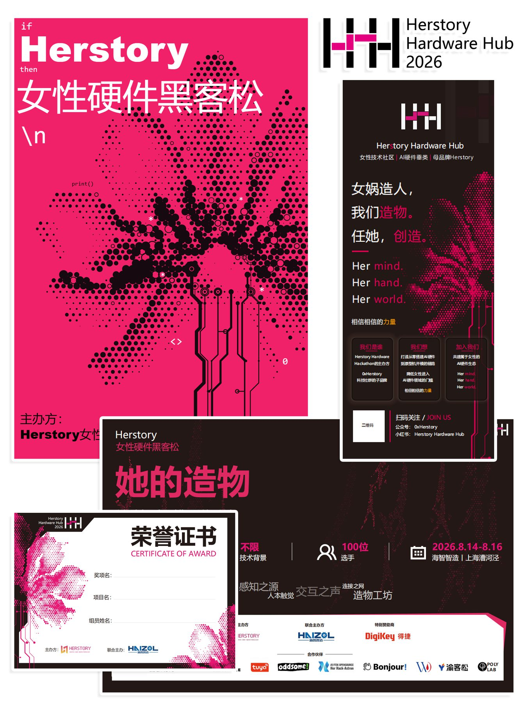 | 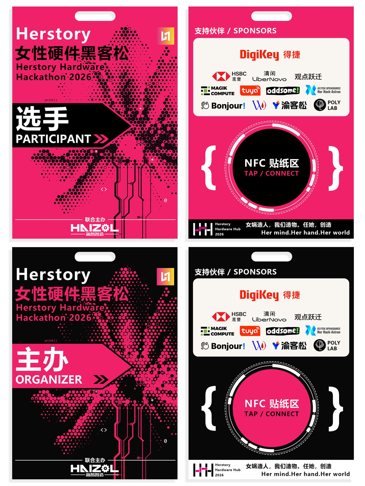 |

同一套洋红、黑、白配色，人物网点、线路和代码符号可以随着嘉宾、主题与载体重新生成和排布。案例覆盖系列分享海报、网站页面、活动主视觉、证书以及选手／主办方证件，展示的不是单张模板，而是一套可以持续生长的视觉系统。

### 像素分享会：从竖版招募海报到横版会场屏幕

| 竖版海报 | 16:9 会场屏幕衍生 |
| --- | --- |
| 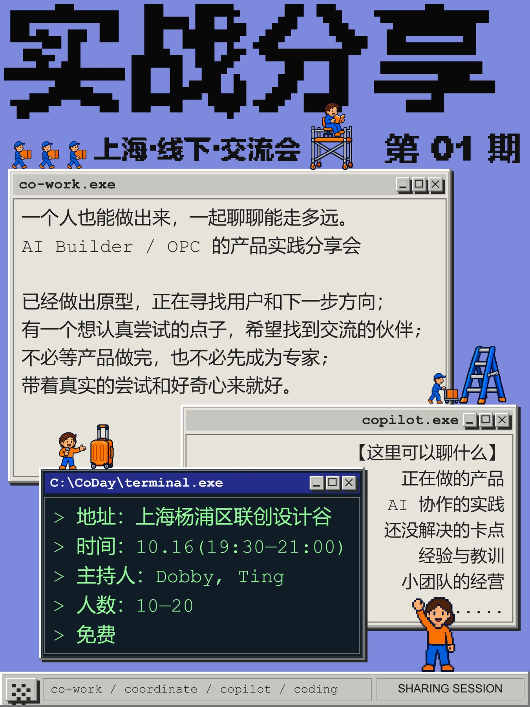 | 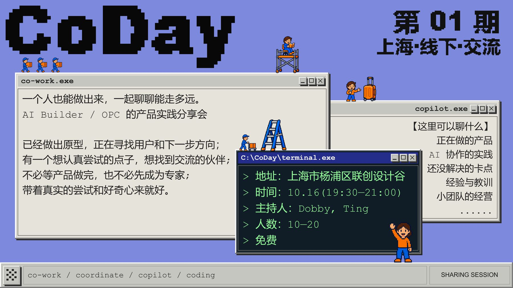 |

窗口、终端、人物与像素标题可分别参与重排。旧工作台中的窗口由多个图层组成；新的生成流程会优先判断它是否应作为可直接填字的整体组件。换成横向屏幕后，信息层级、窗口遮挡关系和人物动线能够重新组织。

这些案例体现了工作台的四类可控能力：

- **风格可控**：统一配色、纹理、网点、像素或几何语言。
- **内容可换**：替换标题、嘉宾、活动信息和图片，不必从头重做视觉体系。
- **版式可重组**：同一套对象适配竖版海报、横版屏幕、证件和大型物料。
- **工程可接力**：通过 `.posterproj` 保存对象、图层和参数，交给伙伴继续编辑。

## 安装

需要能读取本地图片和文件、执行 Python 3.10+ 与 Node.js 18+ 的 Agent。生成的网页只需要现代桌面浏览器，离线可用。

把整个仓库克隆到 Codex 的 Skill 目录：

```sh
git clone https://github.com/YantingShen-dev/poster-style-studio.git ~/.codex/skills/poster-style-studio
```

Windows PowerShell 也可使用：

```powershell
git clone https://github.com/YantingShen-dev/poster-style-studio.git "$env:USERPROFILE\.codex\skills\poster-style-studio"
```

请保留 `SKILL.md`、`assets/`、`references/` 和 `scripts/` 的相对位置。安装后给 Agent 一张参考海报，并输入：

> 使用 $poster-style-studio 把这张海报做成可编辑的网页工作台。请先确认保存目录，再生成网页、初始工程和预览。

## 工作流程

1. **读图与沟通**：识别主要风格结构及协作者的日常改稿动作，决定贴纸、组件或生成系统的编辑单位；在专属重建前询问真正影响实现的选择。
2. **生成专属工作台**：以 `assets/editor/` 为底座，将风格对象、参数和贴纸写入统一工程模型，输出可打开的网页。
3. **编辑与接力**：在网页中管理图层、绘制路径、修改文字与效果；保存 `.posterproj`，由伙伴打开工程继续创作。
4. **导出与部署**：导出 PNG、JPG、SVG 或浏览器打印 PDF；`site/index.html` 可上传静态托管。静态网页不提供实时多人同步，协作通过工程文件接力。

工作台的基础操作包括图层嵌套与蒙版、画布缩放与对齐、路径节点、图片裁切、纯色／多节点渐变／图案填充、描边、投影、发光及常用混合模式。贴纸以缩略图卡片显示并插入可编辑副本。锁定或标记为 `hitTest:false` 的装饰覆盖层不会拦截下方对象的画布选择。

## 用 Codex 实时指挥设计

生成的工作台附带 `live_design.cjs`。在本机运行 `node live_design.cjs serve /absolute/path/to/workbench`，打开命令显示的网址，即可让 Codex 通过本地指令读取当前工程、修改对象与风格参数、调整画布并看到页面立即更新。所有修改仍进入工作台的撤销历史；人工和 Codex 可以接续编辑。网页本身不内置 Agent，关闭本地服务后照常离线使用或静态部署。详细命令见 [实时设计接口](references/live-design.md)。

## 本地构建与验证

从仓库根目录运行：

```sh
python scripts/build_editor.py --output /absolute/path/my-editor
node --test tests/*.test.cjs
python scripts/check_package.py
```

`--output` 必须是空目录。上面第一条命令只生成空白底座；处理参考图时还需建立已初始化的工程，并用 `--project /absolute/path/initial.posterproj` 构建。专属生成器修改后可用 `--source /absolute/path/source` 指定源码。详见 [SKILL.md](SKILL.md) 与 [工程格式](references/project-format.md)。

## 边界与许可

任意参考位图不会自动变成精确矢量；复杂纹理可以保留为内嵌位图。字体跨设备接力时需要检查是否可用或内嵌。SVG 中嵌入的图片仍是位图；PDF 输出依赖浏览器打印。

代码以 [MIT License](LICENSE) 开源。示例截图用于展示工作台界面，不随 Skill 作为海报模板或项目工程分发。
